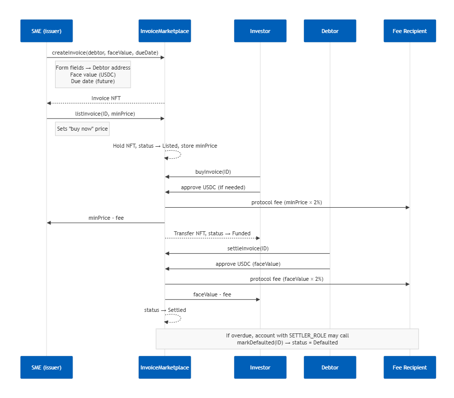

# Arc Invoice Finance dApp



## Overview

Arc Invoice Finance is a proof-of-concept dApp on Arc Testnet that digitizes invoice financing. Every invoice is represented by an ERC‑721 NFT and flows through the following lifecycle:

1. **Create** – The SME wallet calls `createInvoice(debtor, faceValue, dueDate)` to mint a Draft invoice NFT.
2. **List** – The SME sets a fixed selling price via `listInvoice`. The UI automatically approves the marketplace contract (`setApprovalForAll`). Status becomes `Listed`.
3. **Buy** – An investor approves USDC and calls `buyInvoice`. Funds move from investor → SME (minus a 2% protocol fee), and the NFT owner becomes the investor (`Funded` status).
4. **Settle** – The debtor approves USDC and calls `settleInvoice`. The face value (minus fee) is paid to the investor, and the invoice becomes `Settled`. If the debtor misses the deadline plus a 7‑day grace period, the account with `SETTLER_ROLE` can call `markDefaulted`.

## Deployed Contracts (Arc Testnet)

| Contract            | Address                                                 |
| ------------------- | ------------------------------------------------------- |
| InvoiceNFT          | `0xd3c19abB9af47b9E0c8dD4AE6471FaE52F674A4d`            |
| InvoiceMarketplace  | `0x7Ac337E8e335daB629F868f811AfA40986418616`            |
| Native USDC (ERC20) | `0x3600000000000000000000000000000000000000`            |

## Key Features

- Wallet connection (MetaMask) with automatic Arc Testnet detection/switch.
- Invoice creation with minute-level due dates.
- Automatic NFT/USDC approvals before list/buy/settle actions.
- Portfolio view shows invoices related to the connected address (issuer, owner, debtor).
- USDC balances fetched directly from the ERC‑20 contract.

## Getting Started

### Prerequisites
- Node.js ≥ 18
- MetaMask (or any EVM wallet) configured for Arc Testnet
- Arc Testnet USDC (request from https://faucet.circle.com)

### Install & Run
```bash
npm install
npm run dev
```

Create `.env.local` (or `.env`) with:
```
VITE_INVOICE_MARKETPLACE_ADDRESS=0x7Ac337E8e335daB629F868f811AfA40986418616
VITE_INVOICE_NFT_ADDRESS=0xd3c19abB9af47b9E0c8dD4AE6471FaE52F674A4d
VITE_ARC_RPC_URL=https://rpc.testnet.arc.network
```

## User Workflow

1. **Create Invoice** – Connect the SME wallet, open *Create Invoice*, enter the debtor address, face value, and due date (must be in the future), then submit the transaction.  
2. **List Invoice** – In *My Portfolio*, choose a Draft invoice and click “List for Sale”. Provide a minimum price (below face value). MetaMask will prompt for `setApprovalForAll` (first time) and `listInvoice`.  
3. **Buy Invoice** – Switch to the investor wallet, go to *Marketplace*, click “Buy”, and sign the USDC approval (first time) and `buyInvoice` transaction.  
4. **Settle Invoice** – Switch to the debtor wallet (the same address specified when creating the invoice). In *My Portfolio*, the Funded invoice will show “Settle Invoice” once the due date is reached. Approve USDC and sign `settleInvoice`.  
5. **Mark Default** – After the due date plus a 7‑day grace period, the account with `SETTLER_ROLE` (deployer) can mark the invoice as defaulted.

## Development Commands

| Command | Description |
| ------- | ----------- |
| `npm run dev` | Start the Vite development server |
| `npm run build` | Build the production bundle |
| `npx hardhat test` | Run smart contract tests |
| `npx hardhat run scripts/deploy.ts --network arcTestnet` | Deploy contracts to Arc Testnet |

After redeployment, update `.env.local` with the new contract addresses.***
